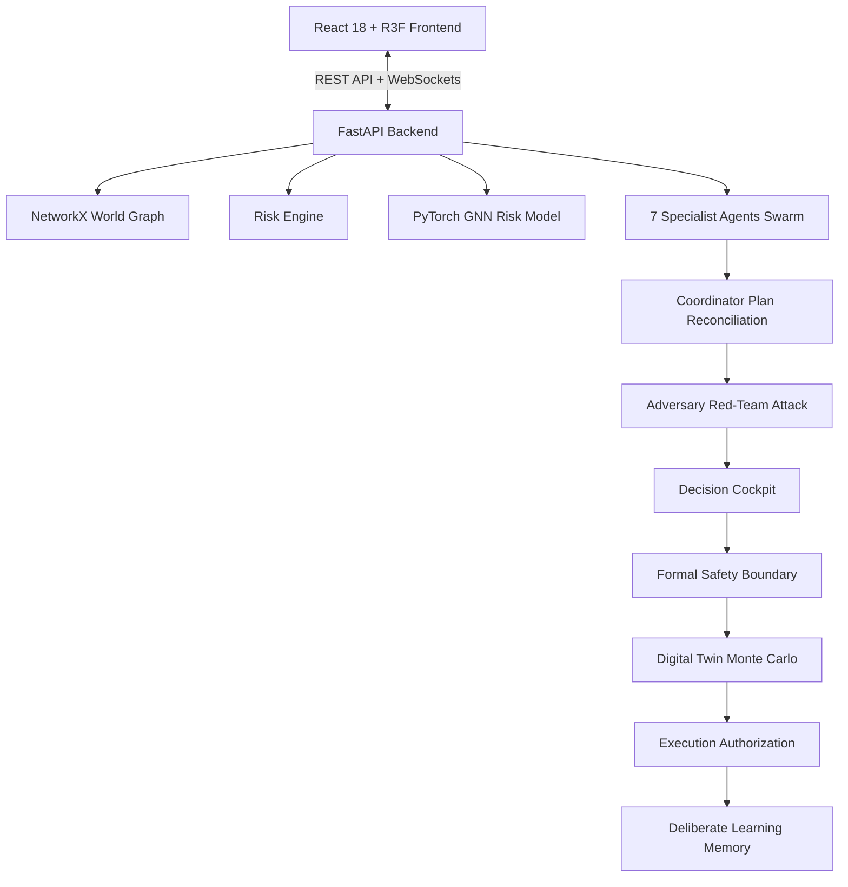
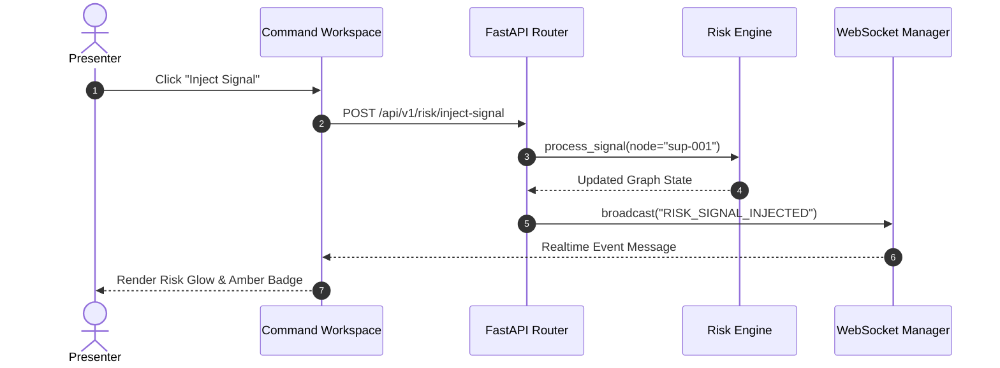

# FULFILL-X — SYSTEM DIAGRAMS

> **Architecture & Flow Diagrams**

---

## 1. Complete System Architecture

```mermaid
graph TD
    UI[React 18 + R3F Frontend] <-->|REST API + WebSockets| API[FastAPI Backend]
    API --> GRAPH[NetworkX World Graph]
    API --> RISK[Risk Engine]
    API --> GNN[PyTorch GNN Risk Model]
    API --> SWARM[7 Specialist Agents Swarm]
    SWARM --> COORD[Coordinator Plan Reconciliation]
    COORD --> ADV[Adversary Red-Team Attack]
    ADV --> COCKPIT[Decision Cockpit]
    COCKPIT --> VERIFY[Formal Safety Boundary]
    VERIFY --> TWIN[Digital Twin Monte Carlo]
    TWIN --> EXEC[Execution Authorization]
    EXEC --> MEM[Deliberate Learning Memory]
```

---

## 2. Request Lifecycle

```mermaid
sequenceDiagram
    autonumber
    actor Presenter
    participant UI as Command Workspace
    participant API as FastAPI Router
    participant Risk as Risk Engine
    participant WS as WebSocket Manager

    Presenter->>UI: Click "Inject Signal"
    UI->>API: POST /api/v1/risk/inject-signal
    API->>Risk: process_signal(node="sup-001")
    Risk-->>API: Updated Graph State
    API->>WS: broadcast("RISK_SIGNAL_INJECTED")
    WS-->>UI: Realtime Event Message
    UI-->>Presenter: Render Risk Glow & Amber Badge
```
